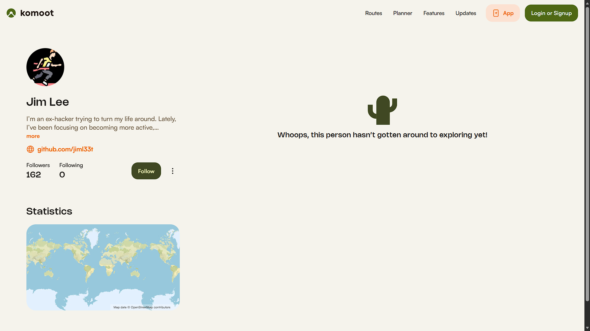
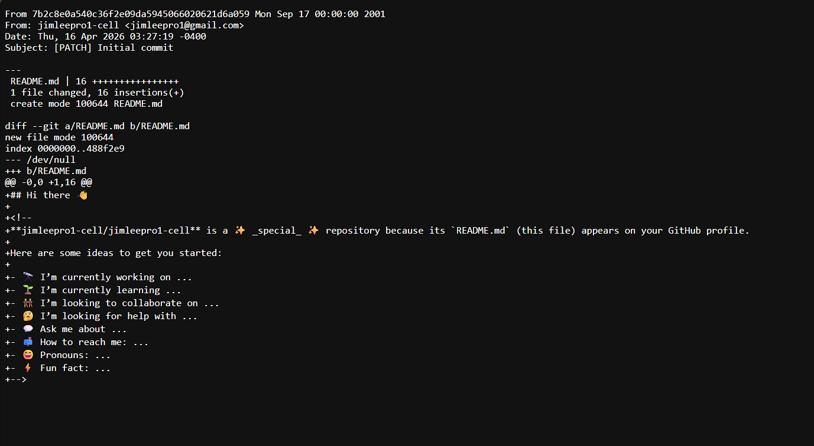
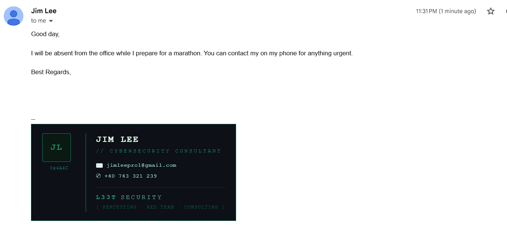
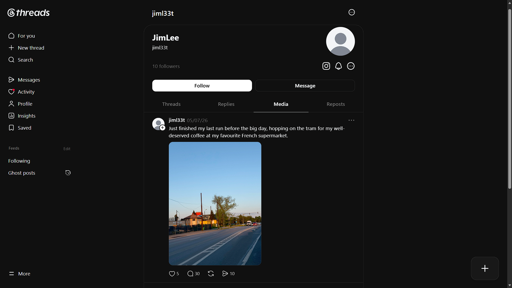
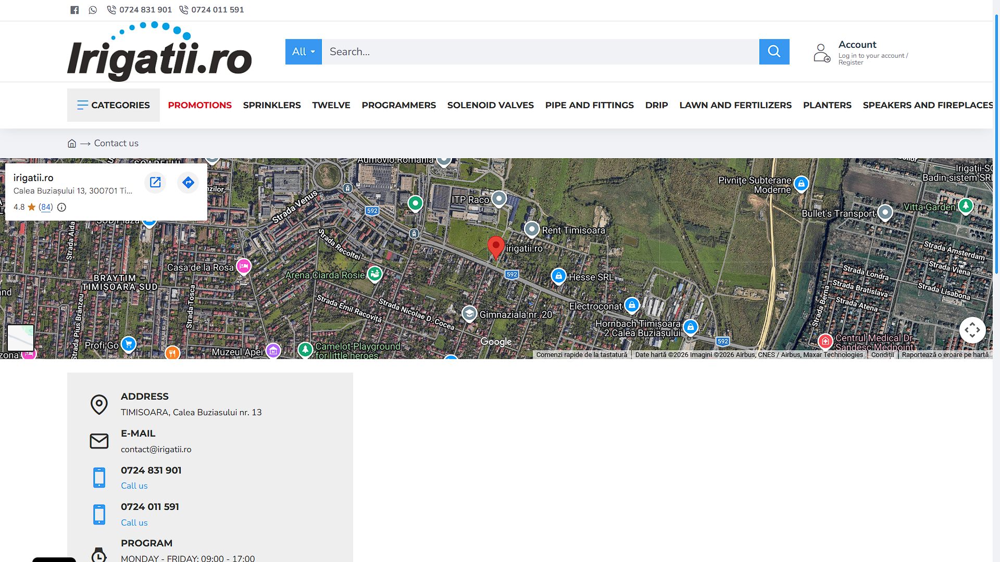
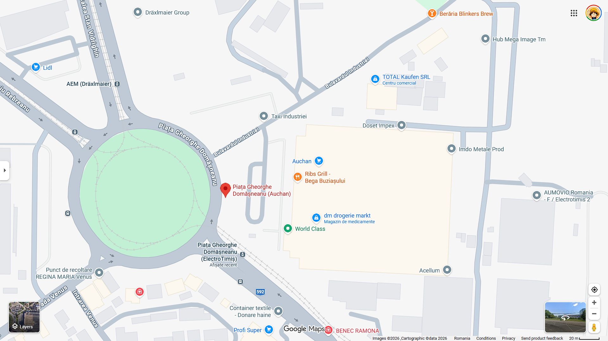

# 🕵️ TryHackMe — Cache Me Outside

> **Difficulty:** Medium | **Platform:** TryHackMe  
> **Author:** [KaydenSir](https://github.com/Noel-BijuJohn) | **Date:** June 2026

---

## 📖 Scenario

### Background

Years after walking away from the scene, a retired hacker has left pieces of his identity scattered across the open internet.

At first glance, it looks like nothing more than a leaked conversation screenshot. But buried in that image is the first thread of a much larger trail. Public profiles, forgotten details, and small mistakes begin to connect into something more deliberate.

Someone wanted this person found.

### Your Assignment

You are an OSINT investigator tasked with identifying the retired hacker and tracing the clues he left behind.

Start with the conversation screenshot, follow his online presence, connect the exposed details, and use the final evidence to determine where the trail ends.


---

## 🔍 Task Breakdown & Solutions

---

### Task 1 — What is the retired hacker's full name?

**Approach:**

The conversation screenshot gives a username hint. Searching that username on **Komoot** (an outdoor activity/navigation platform) reveals a registered account under a real name.



> **Tools used:** Komoot, username search

**Answer:** `Jim Lee`

---

### Task 2 — What email address did he accidentally expose?

**Approach:**

The username `jiml33t` points to a **GitHub** account. Git commit history is a goldmine — developers often expose personal details (emails, names) in their commit metadata.

Steps:
1. Navigate to the GitHub profile: `github.com/jiml33t`
2. Open the commit history of any repo
3. Append `.patch` to the commit URL to reveal the raw commit metadata

```
https://github.com/jiml33t/jiml33t/commit/7b2c8e0a540c36f2e09da5945066020621d6a059.patch
```

The `.patch` file exposes the author's email in the `From:` header.



> **Tools used:** GitHub commit history, `.patch` trick

**Answer:** `jimleepro1@gmail.com`

---

### Task 3 — What is his phone number?

**Approach:**

With the email address in hand, a light social engineering technique was applied — sending an email to the exposed address posing as a contact inquiry.

An **automated reply** was returned, which included his phone number in the response body.



> **Tools used:** Email (social engineering via auto-reply)  
> ⚠️ *This technique is only ethical in authorized CTF/lab environments.*

**Answer:** `+40 743 321 239`

---

### Task 4 — In which city is he located?

**Approach:**

Searching the `jiml33t` username across platforms turns up a **Threads** account. A post on the account contained an image with a visible storefront sign: **irigatti.ro**



- Cross-referencing `irigatti.ro` via a web search reveals it's a Romanian brand
- Geolocation of the brand's physical presence places it in **Timișoara, Romania**



> **Tools used:** Threads (social media), OSINT image analysis, Google search

**Answer:** `Timișoara`

---

### Task 5 — Submit the name of the tram station where he got off on the 7th of May, 2026.

**Approach:**

The Threads image was posted on **7th May 2026**. The caption references a **French supermarket** nearby.

Steps taken:

1. **Image location confirmed** — The irigatti.ro storefront places the subject on **Calea Buziașului**, Timișoara
2. **Transit mapping** — Searching Timișoara's public transit network shows **Tram Line 4** runs along Calea Buziașului
3. **Supermarket identification** — The "French supermarket" reference matches **Auchan**, a major French retail chain, located at *Calea Buziașului nr. 11*
4. **Stop identification** — The tram terminal/stop serving that exact block is **Piața Gheorghe Domășnean**




> **Tools used:** Threads, Google Maps, Timișoara transit maps, Auchan store locator

**Answer:** `Piața Gheorghe Domășnean`

---

## 🛠️ Tools & Resources

- [Komoot](https://www.komoot.com/) — outdoor activity profiles
- [GitHub](https://github.com/) — commit history + `.patch` trick
- [Threads](https://www.threads.net/) — social media OSINT
- [Google Maps](https://maps.google.com/) — geolocation & transit
- [Timișoara Public Transit Maps](https://ratt.ro/) — tram line verification

---

## 👤 Author

**KaydenSir** — Noel Biju John  
[GitHub](https://github.com/Noel-BijuJohn) · [LinkedIn](https://www.linkedin.com/in/noel-biju-john) · [TryHackMe](https://tryhackme.com/)

---

*If this helped you, drop a ⭐ on the repo!*
